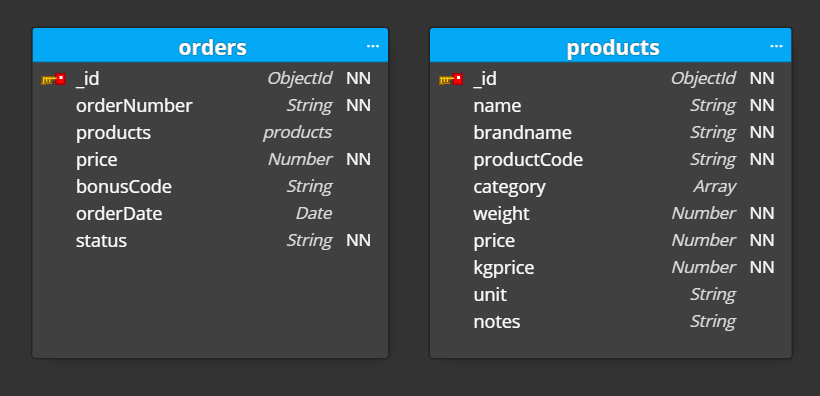
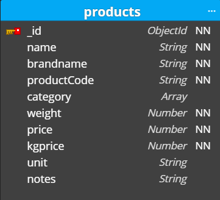
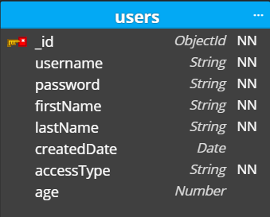
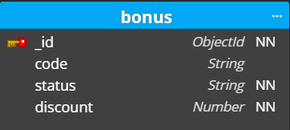
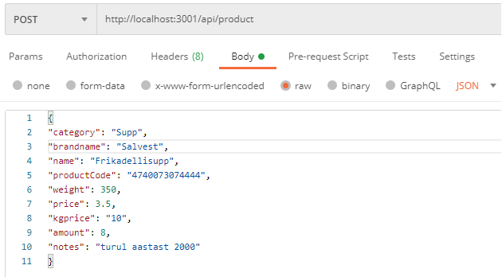
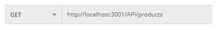
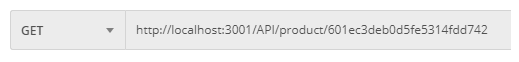
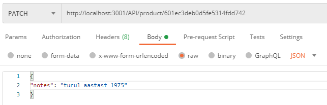
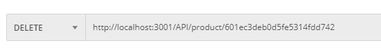
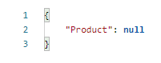

# :memo: Projekt: SALVEST VEEBIPOOD
_____________________________________________________________________________________________________________________________________________________________________________

# Projekti kirjeldus

Projekti eesmärgiks oli luua töötav e-poe back end lahendus 
ning andmebaas koos toodete ja tellimustega. Projekti käigus loodi andmebaasi schema (struktuur) mongoose schema kujul. Projekti toodeteks valiti SALVEST AS tooted kodulehelt: salvest.ee/tooted/ 
Projekti käigus loodi products, orders ja bonus endpointid, mis võimaldavad andmebaasi modifitseerida. Täpsem endpointi-de kirjeldus on toodud allpool.

________________________________________________________________________________________________________________________________________________________________________________
# Konfiguratsioon
Kasutatakse järgmisi lühendeid:
NN - tähistab nõutavat välja (not null)

## Schema Orders koos child schema-ga Products

### Orders endpoint-id
* Tellimuse lisamine - `addOrder`
* Kõikide telimuste leidmine - `getAllOrders`
* Tellimuse leidmine tellimuse ID järgi - `getOrderByID`
* Tellimuse leidmine kuupäeva järgi - `getOrdersByDate`
* Tellimuse leidmine staatuse järgi - `getOrdersByStatus`
* Tellimuse muutmine - `updateOrder`
* Tellimuses toote muutmine toote ID-järgi - `updateOrderProduct`
________________________________________________________________________________________________________________________________________________________________________________
## Schema Products

### Products endpoint-id
* Toote lisamine -`addProduct`
* Kõikide toodete leidmine - `getAllProducts`
* Toote muutmine - `updateProduct`
* Toote leidmine ID järgi - `getProductByID`
* Toote kustutamine - `deleteProduct`
________________________________________________________________________________________________________________________________________________________________________________
## Schema Users

### Users endpoint-id:
* Kasutaja lisamine - `addUser`
* Kõkide kasutajate leidmine - `getAllUsers`
* Kasutaja muutmine - `updateUser`
________________________________________________________________________________________________________________________________________________________________________________
## Schema Bonus

### Bonus endpointid:
* Boonuse lisamine - `addBonus`
* Kõikide boonuste leidmine - `getAllBonus`
* Boonuse muutmine - `updateBonus`
________________________________________________________________________________________________________________________________________________________________________________
# Postmanis POST, GET, PATCH ja DELETE
## (POST) Toote andmebaasi lisamine
- Andmebaasi lisamiseks kasutatakse POST meetodit
- Selleks avame uue päringu Tabi
- Valime päringu tüübiks POST
- Sisestame päringu URL-i. Meie näites server jookseb aadressil `http://localhost:3001`+ `/api` + `/product` (viimane osa kirjeldatud router.js failis).
- Seejärel valida Body -> raw -> faili tüübiks JSON
- Edasi tuleb body-sse sisestada sisestatavad andmed, kui need lisatud, siis saata päring ("Send" nupp)
- Kui päring õnnestub, on toode lisatud, Kontrollimiseks saad kasutada GET meetodit ja vaadata, kas lisatud toode on loendis olemas

## (GET) andmebaasist kõikide toodete otsimine
- Kõikide toodete otsimiseks kasutatame GET päringut
- url `http://localhost:3001/API/products`
- saata päring ("Send" nupp)

## (GET) andmebaasist toote otsimine ID järgi
- Toote otsimiseks ID järgi kasutame samuti GET päringut
- url `http://localhost:3001/API/product/:id` (`:id` asendada otsitava toote ID-ga)
- saata päring ("Send" nupp)

## (PATCH) ühe toote muutmine
- Muutmiseks kasutatakse PATCH meetodit
- Selleks avame uue päringu Tabi
- Valime päringu tüübiks PATCH
- Sisestame päringu URL-i. `http://localhost:3001/API/product/:id` (`:id`asendame selle toote ID-ga, mida muuta soovime)
- Seejärel valida Body -> raw -> faili tüübiks JSON
- Edasi tuleb body-sse sisestada muudetavad andmed, kui need lisatud, siis saata päring ("Send" nupp)
- Kui päring õnnestub, on muudatus tehtud. Kontrollimiseks saad kasutada GET meetodit ja otsida ID-ga toode üles

## (DELETE) ühe toote kustutamine
- Kustutamiseks kasutatakse DELETE meetodit
- Selleks avame uue päringu Tabi
- Valime päringu tüübiks DELETE
- Sisestame päringu URL-i. `http://localhost:3001/API/product/:id` (`:id`asendame selle toote ID-ga, mida kustutada soovime)
- saata päring ("Send" nupp)

- Kui päring õnnestub, on toode kustutatud. Kontrollimiseks saad kasutada GET meetodit. 
- Kui toodet ei leita tagastab vastuseks

___________________________________________________________________________________________________________________________________________________________________________________
## Step 1: Install 
npm install

## Step 2: Make a copy of .env-example named as .env (You can do it manually or run this command in project root)
cp .env-example .env

## Step 3 Add mongo db connection url to .env file
MONGODB_URI=mongodb+srv://<username>:<password>@cluster0.g29ki.mongodb.net/<dbName>?retryWrites=true&w=majority

## Step 4 Run application
npm run start:dev

## Step 5 Open http://localhost:3000 in your browser and you should see "Hakkama said!"
